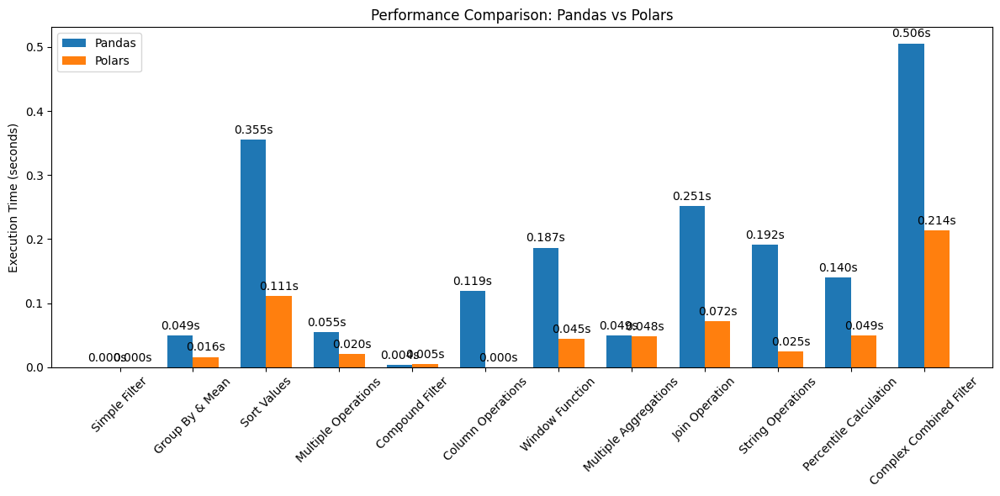
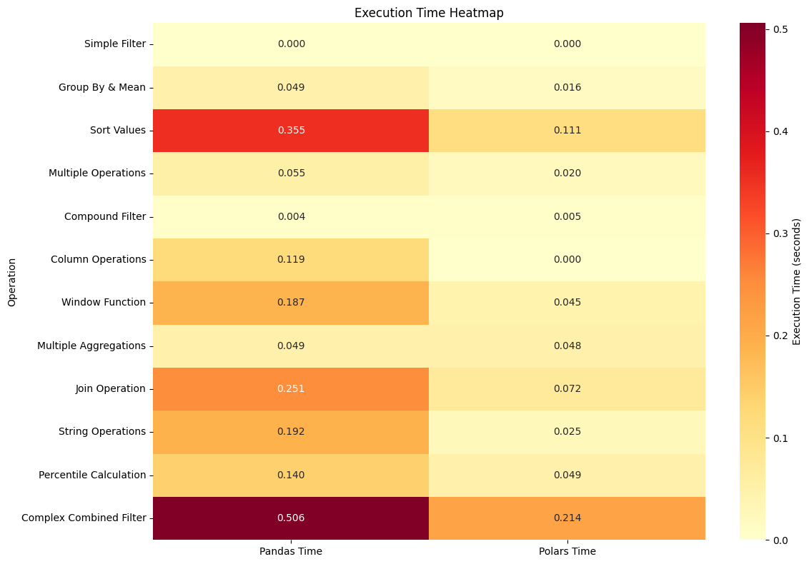
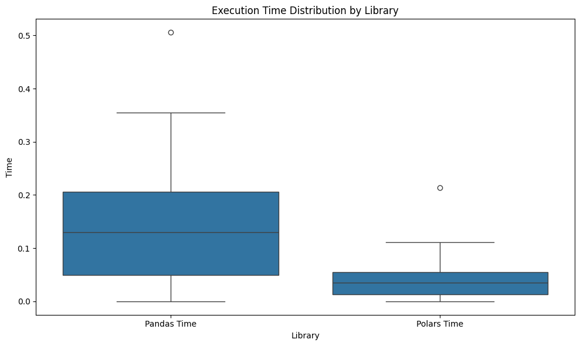

# Polars vs. Pandas Performance Comparison

### TL;DR: Polars is significantly faster than Pandas (in the case of a medium sized dataset of 100,000 rows)

## 📊 Key Findings

- **Overall Speed**: Polars is significantly faster than Pandas, with:
  - Mean execution time: Polars (0.050s) vs. Pandas (0.159s)
  - Median execution time: Polars (0.035s) vs. Pandas (0.130s)

## 🔍 Operations Tested

The comparison included 12 common data operations:
1. Simple Filtering
2. Group By & Mean
3. Sort Values
4. Multiple Operations
5. Compound Filtering
6. Column Operations
7. Window Functions
8. Multiple Aggregations
9. Join Operations
10. String Operations
11. Percentile Calculations
12. Complex Combined Filtering (Yes I just randomly chained methods together)

## 💪 Performance Highlights

### Polars Advantages:
- **Consistently Faster**: Outperforms Pandas in all tested operations
- **Significant Speed-up**: Particularly efficient in:
  - Complex operations
  - Group by operations
  - Join operations
  - Window functions

### Use Cases Where Polars Shines:
- Large dataset processing
- Complex data transformations
- Memory-intensive operations
- Performance-critical applications

## 🔧 Technical Details

The benchmarks were performed using:
- A standardized health dataset
- Multiple iterations to ensure reliable results
- Various common data manipulation operations
- Identical operations in both libraries

## 📈 Conclusion

Based on the benchmark results, Polars demonstrates superior performance compared to Pandas, making it a much better choice for data-intensive applications where performance is crucial. While Pandas remains a popular and "pythonic" approach to handling data, Polars offers a compelling alternative for projects requiring optimal performance.

---
*Note: Actual performance may vary based on specific use cases, data sizes, and system configurations.*

## My Personal Opinion
I found that polars is not as "pythonic" as pandas where in Pandas you can pretty much read English while with Polars some of the methods are not as intuitive. But polars has a much nicer visualization of dataframes in the console. Granted I have done Pandas for much longer than Polars so I might be biased. Further things to consider is what the speedup different might be in a larger or smaller dataset. 

My own conclusion just from testing here and there is that the larger the dataset and when speed is crucial the more likely you should be using Polars while smaller datasets and you need to analyze something quickly Pandas is better.

## Future Considerations
- Smaller/Larger Dataset testing
- More scenarios being tested
- Testing known issues where Pandas is faster than Polars

